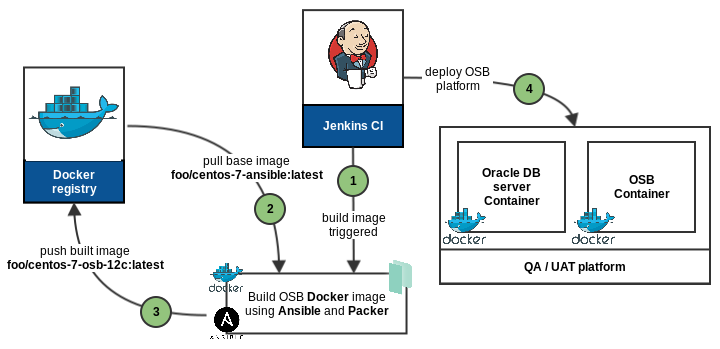
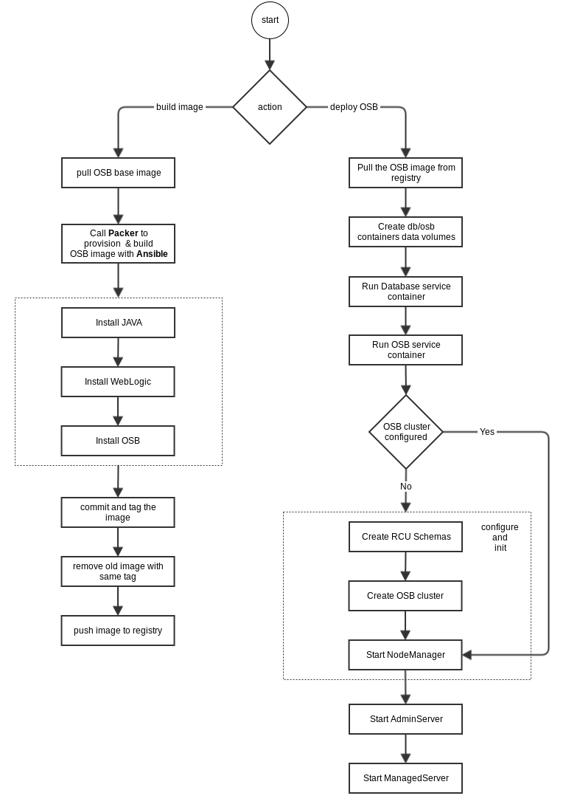
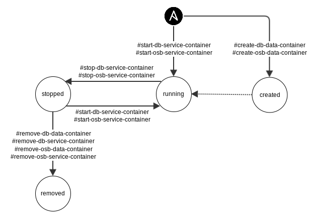

# Ansible OSB Role for Docker

## Description

This is an Ansible role to configure a [Docker](http://www.docker.com) container for Oracle Service Bus 12c.

## Supported systems

- CentOS 7

## Role dependencies

- [ansible-java](https://github.com/abessifi/ansible-java)
- [ansible-weblogic](https://github.com/abessifi/ansible-weblogic)
- [ansible-osb](https://github.com/abessifi/ansible-osb)

## Requirements

### Software Requirements

- **Ansible 1.9** or higher (can be easily installed via `pip`. E.g: `sudo pip install ansible==1.9.2`)
- **[Packer](https://www.packer.io) 0.10** or higher
- **[Docker](https://www.docker.com) 1.10** or higher
- **[Vagrant](https://www.vagrantup.com) 1.7** or higher (for )
- `sshpass` package which is needed by Ansible if you are using SSH authentication by password. On Ubuntu/Debian: `$ sudo apt-get install sshpass`
- **Virtualbox**
- **[Oh-my-box](https://github.com/abessifi/oh-my-box)** tool, optional, if you want to quickly provision and package a Docker base box with **Ansible** and **Ruby** pre-installed.

### Docker image build requirements

- **Oracle JDK 8** [RPM package](http://www.oracle.com/technetwork/java/javase/downloads/jdk8-downloads-2133151.html), `jdk-8u77-linux-x64.rpm` for instance, to install Oracle JAVA 8.

- **Fusion Middleware Infrastructure 12c Plateform**, which You can download the installer JAR file `fmw_12.2.1.0.0_infrastructure.jar` from the [Oracle Software Delivery Cloud](https://edelivery.oracle.com).

- **Oracle Service Bus**, the installer JAR file `fmw_12.2.1.0.0_osb.jar` which can be obtained from the [Oracle Software Delivery Cloud](https://edelivery.oracle.com).

- **SQLPLUS client** [packages](http://www.oracle.com/technetwork/topics/linuxx86-64soft-092277.html). This is not required but may be useful for testing and debugging issues. For example `oracle-instantclient12.1-basic-12.1.0.2.0-1.x86_64.rpm` and `oracle-instantclient12.1-sqlplus-12.1.0.2.0-1.x86_64.rpm` RPM files can be downloaded. See [ansible-sqlplus](https://github.com/abessifi/ansible-sqlplus) role documentation for more details.

- **CentOS 7 Docker image**. You need also to pull a basic CentOS 7 Docker image with Ansible installed. You can already pull the `abessifi/centos-7-ansible` image from Docker hub or use [Oh-my-box](https://github.com/abessifi/oh-my-box) project to quickly build you own ;)

### Memory requirements

A plain installation using this Ansible role and running a nodemanager, an AdminServer and a Managed Server in the same Container, requires at least **4GB** of physical memory.

## Role Variables

#### Build and setup OSB image parameters

- **`jdk_rpm_file`** -  The JDK package file name (default: `jdk-8u77-linux-x64.rpm`)
- **`weblogic_jar_file`** - The weblogic installer JAR name (default: `fmw_12.2.1.0.0_infrastructure.jar`)
- **`osb_jar_file`** - The OSB installer JAR name (default: `fmw_12.2.1.0.0_osb.jar`)
- **`artifacts_download_directory`** - The JARs and RPMs download directory (default: `/srv/files`)
- **`docker_osb_base_img_name`** - A basic CentOS 7 Docker image with Ansible installed (default: `abessifi/centos-7-ansible`)
- **`docker_osb_base_img_pull`** -  Tell Packer to pull or not the basic image (default: `true`)
- **`docker_ansible_tags`** - Tags passed to Packer to provision the OSB image with Ansible (default: `[install-java, wls-plain-install, osb-plain-install]`)
- **`docker_osb_img_repository`** - The generated OSB Docker image name (default: `foobar/centos-7-osb-12c`)
- **`docker_osb_img_tag`** -  The generated OSB Docker image tag (default: `latest`)
- **`ansible_osb_setup_tags`** - Tags which are passed to the embedded `ansible-osb` role to finish configuring the OSB container with Ansible by initializing the AdminServer and the ManagedServer services (default: `[osb-start-adminserver, osb-start-managed-servers]`)

#### Database container setup and connection

- **`docker_database_address`** - The database address (default: `db.weblogic.local`)
- **`docker_database_port`** - The database connection system identifier (default: `1521`)
- **`docker_database_sid`** - The database connection system identifier (default: `xe.oracle.docker`)
- **`docker_database_user`** - The database admin user name (default: `sys`)
- **`docker_database_img_name`** - The Docker image name including an oracle 12c database server (default: `sath89/oracle-12c:latest`)
- **`docker_database_password`** - The database admin user password (default: `oracle`)
- **`docker_database_data_ctn_name`** - The database data volume container name (default: `db-data-ctn`)
- **`docker_database_service_ctn_hostname`** - The Oracle database address/hostname (default: `db.weblogic.local`)
- **`docker_database_service_ctn_name`** - The database service container name (default: `db-service-ctn`)
- **`docker_database_server_host_port`** - The host 'public' port to map to the container database server port (default: `1521`)
- **`docker_database_webadmin_host_port`** - The host 'public' port to map to the container database webadmin http port (default: `8080`)
- **`docker_database_dbca_memory`** - Max Oracle DBCA memory (default: `768`)
- **`docker_database_service_ctn_memory`** - Max memory allocated to the database service container (default: `1024MB`)

#### OSB container setup and connection

- **`docker_osb_img_name`** - The OSB image name (default: `foobar/centos-7-osb-12c`)
- **`docker_osb_data_ctn_name`** - The OSB data volume container name (default: `osb-data-ctn`)
- **`docker_osb_service_ctn_name`** - The OSB service container name (default: `osb-service-ctn`)
- **`docker_osb_service_ctn_hostname`** - The OSB container address/hostname (default: `osb.weblogic.local`)
- **`docker_osb_adminserver_host_port`** - The host 'public' port to map to the AdminServer http port (default: `7001`)
- **`docker_osb_managedserver_host_port`** - The host 'public' port to map to the ManagedServer http port (defaul: `8000`)
- **`docker_osb_service_ctn_memory`** - Max memory allocated to the OSB service container (default: `4GB`)

## Available tags

- **`build-osb-base-image`** - Build and tag an OSB image
- **`create-db-data-container`** - Create the database data container
- **`start-db-service-container`** - Start the database service container
- **`stop-db-service-container`** - Stop the database service container
- **`remove-db-service-container`** - Remove  the database service container
- **`remove-db-data-container`** - Remove the database data and service container
- **`check-db-connection`** - Get database service container status
- **`create-osb-data-container`** - Create the OSB data container
- **`start-osb-service-container`** - Start the OSB service container
- **`stop-osb-service-container`** - Stop the OSB service container
- **`remove-osb-service-container`** - Remove  the OSB service container
- **`remove-osb-data-container`** - Remove the OSB data and service containers
- **`check-osb-service-ctn-status`** - Get the OSB service container status
- **`start-all-services`** - Create and start the database and the OSB data/service containers
- **`stop-all-services`** - Stop the database and the OSB service containers

## Local facts

- None.

# Image build process and containers lifecycle

## Typical CI/CD process



The above picture is an overview of a typical and classical Continuous Integration and Continuous Delivery process. Basically, the idea is to build, tag and push the OSB image to a public/private Docker registry which can be used later for deploying an OSB platform on-the-fly. A CI tool such as Jenkins can automate the entire process allowing deployment of an OSB development/testing platform from scratch in less than 20 minutes.

## OSB image/container build and setup

The following diagram describes the different steps to build and deploy an OSB platform. All build and deployment processes are fully automated. The tricky part is how to start the **Nodemanager** process in foreground, so Docker can catch the stderr/stdout logs, and then running the **AdminServer** and **ManagedServer** processes.

Basically the idea is to startup the OSB container with the Nodemanager as a first step, wait for it to be up and then finally attack the container with a `docker exec` to run the AdminServer/ManagedServer processes.

**Note:** Actually All WebLogic services are running in the same container. This is a Docker anti-pattern and before long, this role will support splitting each service in a separate container to run the OSB platform in a clustered mode.



## Database and OSB containers lifecycle

This is mainly the containers lifecycle which is managed directly with the role tags (see `Available tags` section).



**Note:** After initialization, the OSB platform is fully functional. In case of a graceful stop or a system issue, you can reboot the database and the OSB containers. All the data and configuration are persisted so the Nodemanager will run correctly and will automatically start the AdminServer and the ManagedServer processes and put them to the correct state.

# Usage

All the following use cases and ansible-playbook commands are ran locally for quick tests reasons. To provision a remote server, you have just to correctly prepare the Ansible inventory file and the host/group variables. You can take a look on the Vagrantfile and see the actual configuration example to understand a bit how to run this Ansible role on a Vagrant VM (section `Test with Vagrant`).

## Installation

First of all, make sure you've downloaded the required packages from Oracle website (See `Docker image build requirements` section).

Create a local working directory on the host machine where you can put the downloaded Oracle JAR/RPM files, lets say `/srv/files/`.

## Build base image

You can use this role within a Continuous Integration process to build, tag and push the OSB image to a private registry for instance. To build and tag a Docker image, simply create the following playbook:

```yaml
- hosts: localhost
  roles:
    - role: abessifi.docker-osb
      docker_osb_img_repository: 'abessifi/centos-7-osb-12c'
      docker_osb_img_tag: '0.1'
```

and then call Ansible to play it:

	$ ansible-playbook -c local --tags="build-osb-base-image" provision.yml

**Note:** this task duration is about `7 minutes`.

#### What if you want to include the SQL*PLUS client tool ?

It is easy to include the SQL*PLUS database client tool to the OSB base image. A such tool can be very helpful for testing and debugging database connection issues. To do so, use the following Ansible playbook and build the image:

```yaml
- hosts: localhost
  roles:
    - role: abessifi.docker-osb
      docker_ansible_tags:
        - install-java
        - install-sqlplus
        - wls-plain-install
        - osb-plain-install
      docker_osb_img_repository: 'abessifi/centos-7-osb-12c'
      docker_osb_img_tag: '0.1'
```

## Create and start the database service container

To create and start the database container, just run the following playbook with the `start-db-service-container` tag.

```yaml
- hosts: localhost
  roles:
    - role: abessifi.docker-osb
```


	ansible-playbook -c local --tags="start-db-service-container" -v provision.yml

**Note:** this is the most time consuming task during a platform deployment. It's duration is about `8 minutes`.

## Remove the database data container
For a fresh OSB re-installation, for example, you can remove if you want the database service container, purge data and instantiate a new one:

	ansible-playbook -c local --tags="remove-db-data-container" -v provision.yml

**Note:** purging the database container data leads to automatically stop and remove the service container.

## Deploy all from scratch

It is possible to perform the deployment of the OSB platform, database included, in one single shot using the Ansible tag `start-all-services`:

	ansible-playbook -c local --tags="start-all-services" -v provision.yml

Here is an example of an Ansible playbook that throwing a Docker container with 6GB of memory:

```yaml
- hosts: localhost
  roles:
    - role: docker-osb
      docker_osb_service_ctn_memory: '6GB'
      docker_osb_adminserver_host_port: 9000
      docker_osb_managedserver_host_port: 9001
```

After deployment you can access/query :
- The AdminServer configuration console: http://localhost:9000/console
- The OSB configuration console: http://localhost:9000/servicebus
- The OSB application server: http://localhost:9001/

**Notes:**
- Ansible provision and brings an OSB platform up and running in about `13 minutes` (database included).
- Use `docker stats` command to check the memory limitation.

## Start OSB service

To start the OSB service, after a system issue for instance, you can call Ansible the `start-osb-service-container` tag:

  ansible-playbook -c local --tags="start-osb-service-container" provision.yml

# Development and testing

## Test with Vagrant

TODO.

## Run acceptance tests

TODO.

## Notes

- This project is Ansible 2.0 compatible.
- Containers memory limitation didn't work correctly with Ansible 1.9.2. If you care about memory limitation, you can run this role with Ansible 2.0 and make sure that containers memory is limited as expected.
- Actually, the OSB container depends on the database container image `sath89/oracle-12c`. If you want to build and link a database container, based on another Docker image, the provisioning may fail.

# Author

This role was created by [Ahmed Bessifi](https://www.linkedin.com/in/abessifi), a DevOps enthusiast.
